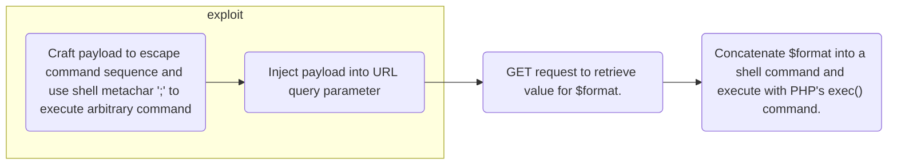

import Callout from '../../../components/Callout.astro';

HTB Try Out was a Jeapordy-type CTF. It was really fun and the challenges were relatively easy. Check the **sidebar** for the writeups. This page is exclusively for notes on vulnerabilities found in the challenges.

## Time Korp (web)

Time Korp had a **CWE-78: OS Command Injection** vulnerability. The key was in the `challenge/models/TimeModel.php` file, where unsanitized user input was concatenated to form a shell command and run using PHP's `exec()` function. The payload was used to escape the command sequence to execute arbitrary OS commands like `ls -la` and `cat`.

```php title="challenge/models/TimeModel.php"
$this->command = "date '+" . $format . "' 2>&1";
$time = exec($this->command);
```

The value of `$format` was retrieved using a `GET` request, this was reflected in the query parameter in the URL. Thus, I injected my payload in the URL.

```
http://154.57.164.75:31545/?format=%27%3B%20cat%20..%2Fflag%3B%20%23
```

This would be interpreted as 

```bash
date ''; cat ../flag; # 2>&1
```

by the shell. Allowing me to read the contents of the flag by displaying it in the appropriate HTML tag displaying the result of `exec($time)` was displayed in, solving the CTF.



<Callout type="warning" title="CWE-78: OS Command Injection" collapsed>

[CWE-611](https://cwe.mitre.org/data/definitions/78.html) is as the *improper neutralization of special elements used in an OS command*, a.k.a an **OS Command Injection**. It happens when an application constructs and executes an OS command using unsanitized user input.

If user-controlled data is concatenated into a shell command, an attacker can inject shell metacharacters (;, &&, |, backticks, $(), etc.) to execute arbitrary commands.

</Callout>

### Mitigating CWE-78

---

## Jailbreak (web)

<Callout type="warning" title="CWE-611" collapsed>

Improper Restriction of XML External Entity Reference

</Callout>
