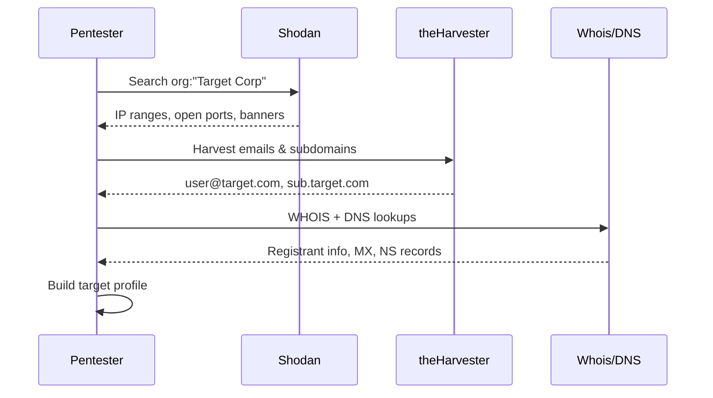

import Callout from '../../components/Callout.astro';
import Badge from '../../components/Badge.astro';

## Recon Workflow



## Introduction

Open Source Intelligence (OSINT) is the practice of collecting information from publicly available sources. During penetration tests and red team engagements, passive reconnaissance lets you gather intel without touching the target directly.

<Callout type="info" title="What is Passive Recon?">
Passive recon means gathering intelligence without sending packets to the target. You rely entirely on third-party sources, cached data, and public databases.
</Callout>

## Shodan

Shodan is a search engine for internet-connected devices. Unlike Google, it indexes banners and service information rather than web content.

### Basic queries

```bash
# Find open RDP ports in a specific country
country:US port:3389

# Search for a specific org
org:"Target Corp" port:443

# Default credentials / known vuln banners
"default password" port:22
```

<Callout type="warning" title="Legal Notice" collapsed={false}>
Always ensure you have written authorization before acting on OSINT findings. Passive recon is generally legal, but using that info for unauthorized access is not.

```python
# Example: programmatic Shodan query
import shodan

api = shodan.Shodan("YOUR_API_KEY")
results = api.search('org:"TargetCorp"')
for result in results['matches']:
    print(result['ip_str'], result['data'])
```
</Callout>

## theHarvester

theHarvester is an excellent tool for email harvesting, subdomain enumeration, and employee name discovery.

```bash
# Basic usage
theHarvester -d target.com -b google,bing,linkedin

# Save results
theHarvester -d target.com -b all -f output.html
```

## Conclusion

OSINT is a powerful first step in any engagement. By combining tools like Shodan, theHarvester, and manual research you can build a comprehensive picture of a target without ever touching their infrastructure.
