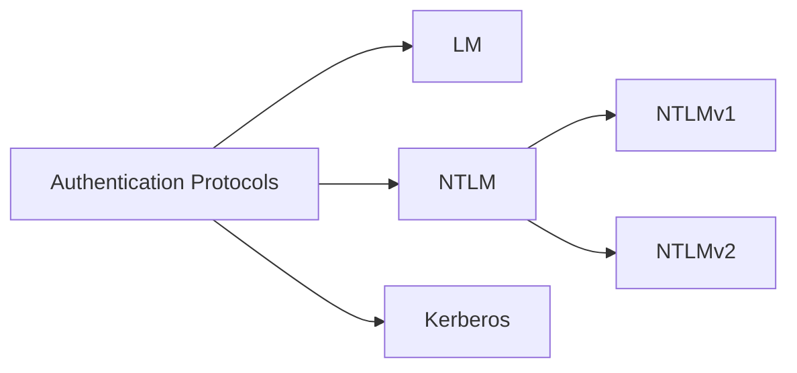

import Callout from '../../../components/Callout.astro';

# Windows Authentication Process

Before we dive into Windows authentication and how it works, we must first understand the components in charge of enforcing these security policies and performing authentication services within the Windows OS. 

## WinLogon, LogonUI, and Credential Providers

> TL;DR: "Logon" (Microslop's preferred naming convention instead of "Login") is the entire process of you entering your creds in a fancy UI rendered by a process (`%SystemRoot%\System32\LogonUI.exe`) launched by a critical system process (`WinLogon.exe`). A credential provider collects it and translates it into a data structure understood by LSASS, sends it back to WinLogon, which relays it to LSASS. 

### WinLogon


### LogonUI 


### Credential Providers


## LSA, LSASS and Authentication Packages

> TL;DR: LSA is an overall security architecture which enforces security policies and authenticate users. LSASS is the process which implements LSA functionalities. Runs as `lsass.exe` and pulls authentication packages (modular libraries --`.ddl`s), when needed depending on environment (Workgroup/AD).

### LSA & Authentication Packages

When you attempt to log into a Windows machine, access a network resource, or authenticate with a service, it's the responsibility of the **Local Security Authority (LSA)** to coordinate with authentication packages to carry out these operations. Moreover, the LSA defines how security decisions are made and manages components like SAM and LSA secrets.

{/* ============ WORK ON ============ */}
<Callout type="warning" title="TL;DR: What are Authentication Packages?" collapsed>
These are `.dll` (Port Executable) files that sit somewhere in your system the LSA uses to facilitate authentication methods during the logon process. They have no entrypoint (`main`) and are designed to be loaded from another process's memory (in this case `lsass.exe`) and called from there during runtime.

The LSA, having a list of these authentication packages, does not know what any of them do, so it instead loops through all of them until it finds the right one to successfully handle the input credentials. Once it's found, the package chimes in and runs the password through some algorithm to do whatever it has to during authentication. Upon completion, the logon triggers your desktop to load.

<Callout type="example" title="Authentication Packages" collapsed>
|Package|Description|
|---|---|
|`Lsasrv.dll` |Core of LSASS & acts as the security packet manager for LSA. Contains the negotiate function which determines what authentication protocol to use, preferring Kerberos (`Kerberos.dll`) but falls back to NTLM (`Msv1_0.dll`) if Kerberos isn't available.|
|`Msv1_0.dll`|Handles **NTLM**. Used for local authentication/auth with a machine without Kerberos. Generates & caches NT hash of passwords in LSASS which is targeted by mimikatz during post-exploitation.|
|`Kerberos.dll` **[SPACER_LG]**|Handles **Kerberos** authentication in AD environments. When you log into a domain, `Kerberos.dll` communicates with DC to obtain tickets (TGTs) used for authenticating to resources.|
|`Samsrv.dll`|**SAM server library**. Implements actual logic for interacting with SAM database (`C:\Windows\System32\config\SAM`). R/W user acc. info and password hashes, enforce account policies and exposes SAM functionalities to LSASS via RPC so other components can query/modify accounts.|
|`Ntdsa.dll`|AD equivalent of `Samsrv.dll`. **Directory Service Agent (DSA)** and lives in DC. R/W to NTDS.dit (AD database), handles LDAP queries and handles replication between DCs (sync)|
|`Netlogon.dll`|Implements **Netlogon service** responsible for authenticating users & machines in domain environments. Ferries authentication requests securely between machine's LSASS and DC's LSASS. Was also subject to [Zerologon vulnerability (CVE-2020-1472)](https://www.huntress.com/threat-library/vulnerabilities/cve-2020-1472).|
</Callout>

</Callout>

### LSASS

While LSA is the overarching security architecture, **Local Security Authority Subsystem Service (LSASS)** (`%WINDIR%\System32\lsass.exe`) is the process that implements LSA functionality, running as a **Protected Process Light (PPL)**. Marking LSASS as a PPL prevents it from being tampered with by non-administrative processes -- we can achieve this by navigating to the registry key located at `HKEY_LOCAL_MACHINE\SYSTEM\CurrentControlSet\Control\Lsa` and assigning it a value `RunAsPPL` with the data `1`.

On modern Windows 10/11 and Server 2019+, LSASS runs as PPL by default. We can verify this with:

```powershell
Get-ItemProperty -Path "HKLM:\SYSTEM\CurrentControlSet\Control\Lsa" -Name "RunAsPPL"
```

### More on LSA, Workgroups and AD

A few examples of what LSA does include:

- Registering a user and storing their credentials.
- Validating user credentials against the SAM database.
- Creating *access tokens* to enforce access control decisions.
- Enforces local security policy (eg. account lockout settings and logon restrictions).

...to name a few. We'll get into the buzzwords in a minute. How the LSA acts primarily depends on the type of network setup, and there are two main types:

1. **Local/workgroup**: These are found in small offices or in houses. One such example is a Laptop running Windows, a printer and a NAS server all connected to each other in a home LAN network. These devices communicate with each other to access shared resources. 
2. **Active Directory (AD)**: AD is essentially an infrastructure designed by Microsoft to centralize and organize network resources in Windows-based   environments. You'll find these in larger offices like *enterprise environments*.

While they sound similar, there are a few differences to keep in mind.

|Workgroup|Active Directory|
|---|---|
|Decentralized network|Centralized network|
|Devices connected in peer-to-peer (p2p) network and share resources amongst each other.|Devices connected in a client-server network where the **Domain Controller (DC)** acts as the server for a specific domain.|
|Every machine manages its own users, credentials, and policies independently.|Group policies, access control and security settings enforced by the DC on every device (domain-joined machine) connected to it.|
|Scales horrendously which is why it's used in smaller setups|Designed to scale thousands of machines and users|

<Callout type="tip" title="AD analogy using Severance as a reference" collapsed>
Here's a great analogy of how an AD environment works. If you've watched Severance, then you probably know how Harmony Cobel manages the severed workers in the severed floor (Mark, Helly, Dylan, Irving, etc.). Using this you can think of Harmony Cobel as the DC, the severed floor as the domain, and the severed workers as the domain-joined devices connected to the DC. This would also imply that other departments in Lumon would also be domains with their own Harmony Cobels (DCs) and staff (devices). It's important to note that in actual AD environments, you might find more than one domain controller syncing the same data and enforcing the same policies for redundancy. 
</Callout>

Getting back to LSA, now that we've seen the two common setups we can understand how LSA's operations differ.

- In workgroups, the LSA authenticates users against the local **Security Account Manager (SAM)** of the device they're trying to access.
- In Active Directory environments, the LSA forwards authentication requests to the Domain Controller, which validates credentials against the **NTDS.dit database** -- the AD equivalent of SAM -- on behalf of the entire domain.

## Credential Manager, SAM and NTDS.dit [**WIP**]

> SAM and NTDS.dit are credential stores. SAM is found on individual machines in workgroup environments and is accessed by the local LSASS via `samsrv.dll`. NTDS.dit lives on Domain Controllers in AD environments — when a domain-joined machine needs to authenticate a user, it forwards the request to the DC via `netlogon.dll`, where the DC's own LSASS interfaces with NTDS.dit through `ntdsa.dll`.

### Security Account Manager (SAM)

### NTDS.dit


## Authentication types [**WIP**]

> TL;DR: LM is crackable so deprecated. NTLM uses challeng-response mechanism to authenticate a user without having the password sent over the network. Kerberos provide users with tickets (reusable stuff) which they can use to authenticate with network resources.




### LM authentication (Deprecated)

LAN Manager (LM) authentication hashes a password by first converting it entirely into uppercase then breaking it into 2 chunks of seven characters each and encrypting each chunk via 56-bit DES (now easily crackable). Because it's not case sensitive, it can be easily cracked.

### NTLM

### Kerberos

--- 

# References

- https://academy.hackthebox.com/module/147/section/1313
- https://syfuhs.net/what-happens-when-you-type-your-password-into-windows
- https://blog.cyberadvisors.com/technical-blog/blog/credential-dumping-protections-part-1-lsa-protection
- https://www.elastic.co/blog/protecting-windows-protected-processes
- https://learn.microsoft.com/en-us/windows-server/security/kerberos/ntlm-overview
