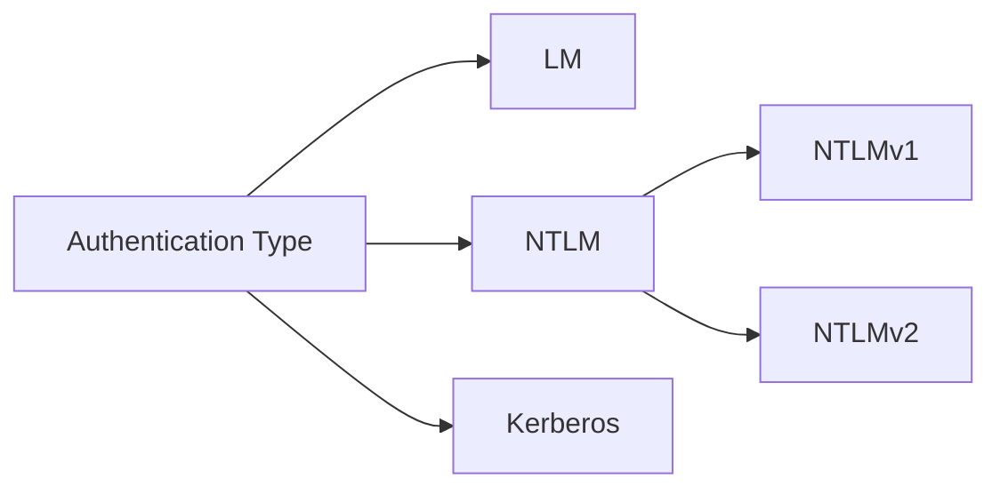

import Callout from '../../../components/Callout.astro';

# Introduction

# Windows Authentication Process

## LSA, LSASS and `lsass.exe`

Before we dive into windows authentication protocols and how they work, we must first understand the middleman in charge of performing authentication services and several other security policies within the Windows OS. And that is, slop #1: LSA.

When you attempt to log into your Windows system, authenticate with one or access a shared resource, it is the responsibility of the **Local Secrutiy Authority (LSA)** to communicate with several authentication packages (DLLs) to perform these authentication processes/checks. LSA in itself is merely a concept, whereas slop #2: **Local Security Authority Subsystem Service (LSASS)** (`%WINDIR%\System32\lsass.exe`) is the process that implements LSA functionality which runs as a **Protected Process Light (PPL)**. 

<Callout type="note" title="What is a PPL?" collapsed="true">
A 
</Callout>

A few examples of what LSA does includes:

- Registering a user and storing their credentials.
- Validating user credentials against the SAM database.
- Creating *acces tokens* to enforce access control decisions.
- Enforce local security policy (eg. account lockout settings and logon restrictions).

To name a few. We'll get into the buzzwords in a minute. How the LSA acts primarily depends on the type of network setup, and there are 2 main types:

1. **Local/workgroup**: These are found in small offices or in houses. One such example is a Laptop running Windows, a printer and a NAS server all connected to each other in a home LAN network. These devices communicate with each other to access shared resources.
2. **Active Directory (AD)**: This is essentially an infrastructure designed by Microsoft to centralize and organize network resources in Windows-based   environments where you'd find a hivemind of Windows slop communicating with each other to access shared resources. You'll find these in larger offices like *enterprise environments*.

## Authentication types

### LM authentication

LAN Manager (LM) authentication hashes a password by first converting it entirely into uppercase then breaking it into 2 chunks of seven characters each and encrypting each chunk via 56-bit DES (now easily crackable). Because it's not case sensitive, it can be easily cracked.

### NTLM

> NTLM authentication is still supported and must be used for Windows authentication with systems configured as a member of a workgroup. NTLM authentication is also used for local logon authentication on non-domain controllers. Kerberos version 5 authentication is the preferred authentication method for Active Directory environments, but a non-Microsoft or Microsoft application might still use NTLM.

--- 

# References

- https://learn.microsoft.com/en-us/windows-server/security/kerberos/ntlm-overview

